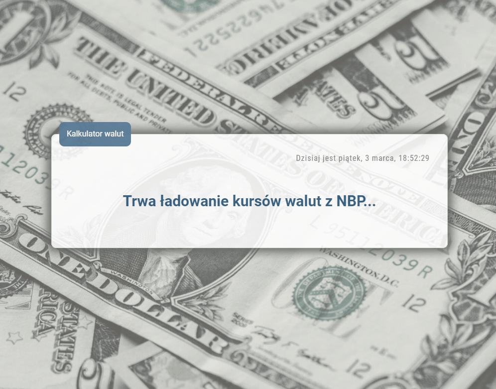
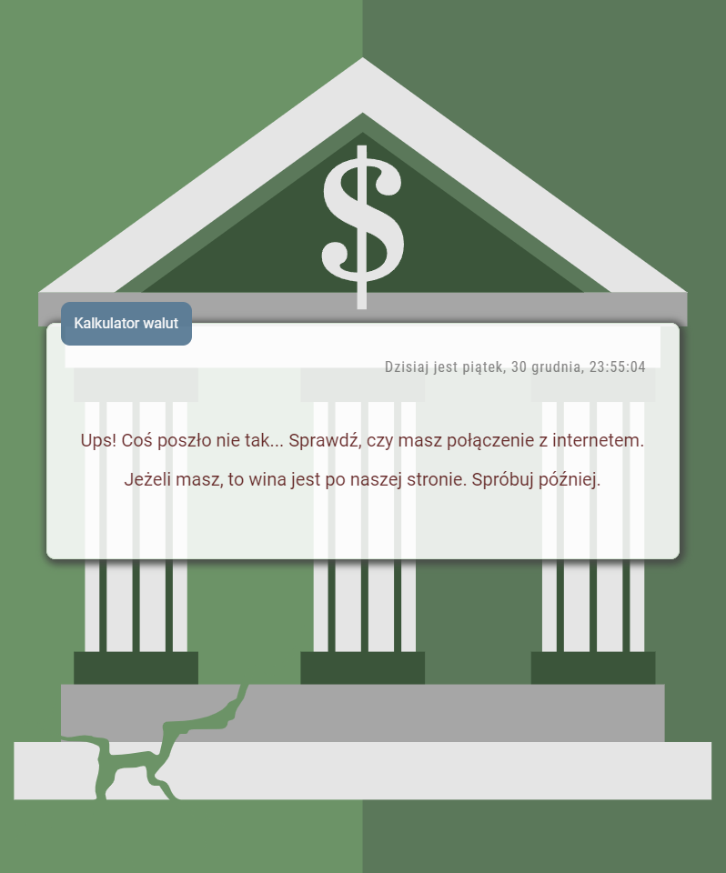

# Marcin Augun - Currency Converter

[](https://marcin10lw.github.io/currency-converter-react/)

## Description

Welcome to the Currency Converter project! This is a currency calculator that can convert currencies using data fetched **fetched from [exchangerate.host](https://exchangerate.host/#/) open API.**

## Live Site URL: [marcin10lw.github.io/currency-converter-react](https://marcin10lw.github.io/currency-converter-react/)

## YouCode

This project is a task within [YouCode](https://youcode.pl/zostawiam-maila/).

YouCode is a frontend development online school with great community.

# 💻 Project Tech Stack:


## Page Preview 💻



## Error preview



## Getting Started

This project was bootstrapped with [Create React App](https://github.com/facebook/create-react-app).

To get a local copy up and running follow these simple steps.

### Installing

1. Clone the repo:

```bash
git clone https://github.com/marcin10lw/currency-converter-react
```

2. Change into the project directory:

```bash
cd currency-converter-react
```

3. Install dependencies:

```bash
npm install
```

### Running the development server

```bash
npm start
```

Then open http://localhost:3000 to view the app in your browser.
